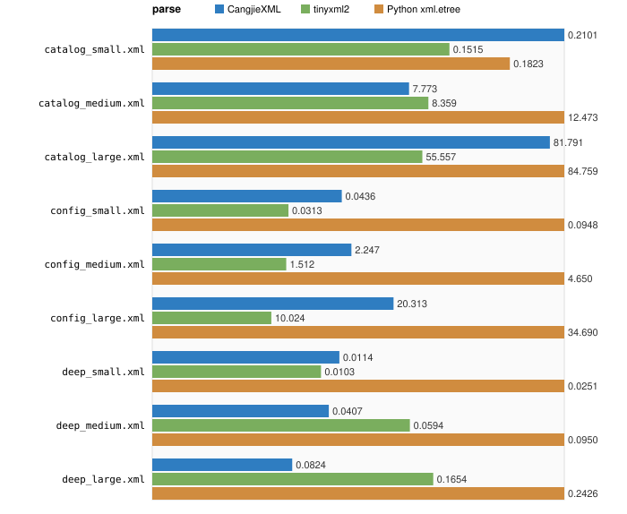
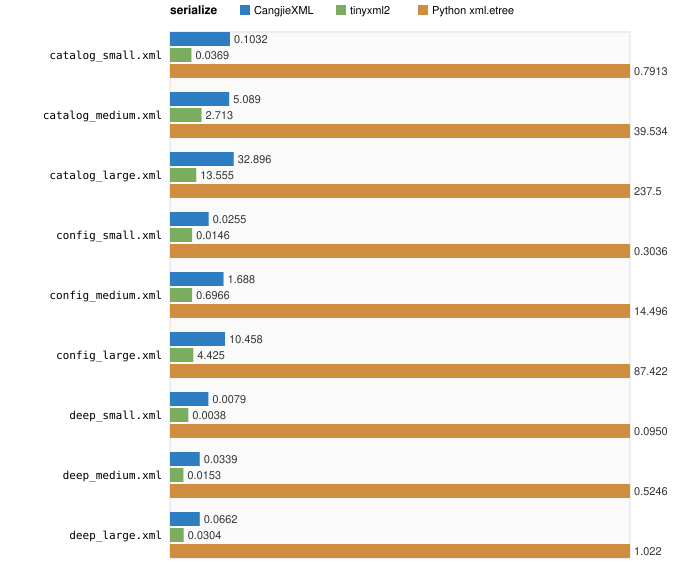
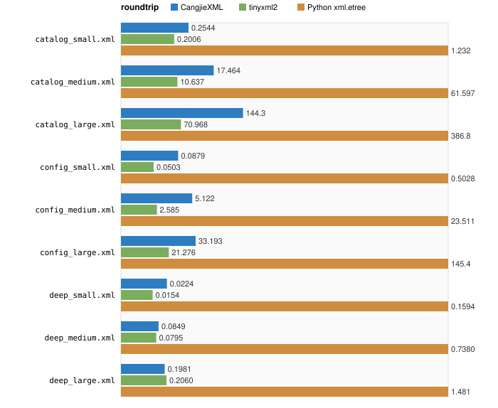
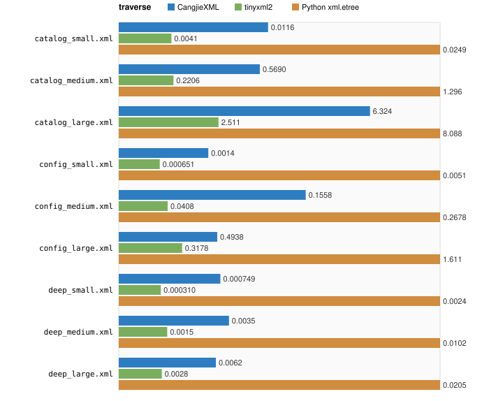

# 性能对比：CangjieXML / tinyxml2 / Python xml.etree

> 由 `perf/report.py` 自动生成，请勿手工修改。
> 重新生成：先 `python3 perf/bench.py` 跑基准，再 `python3 perf/report.py` 出报告。

## 测试方法

- 三端共享同一组 fixture（`perf/fixtures/`）：紧凑 UTF-8 XML，覆盖目录型 / 属性密集型 / 深嵌套三种形态，每种 small / medium / large 三档共 9 份。
- 四个场景：`parse` 解析为 DOM、`serialize` 序列化为字节、`roundtrip` 解析后立即序列化、`traverse` 深度遍历整棵 DOM。
- 计时：单调时钟（C++ `steady_clock` / Python `perf_counter_ns` / 仓颉 `MonoTime`），单位毫秒；每个单元跑 N 次取平均，N 由 fixture 字节量决定，目标单元总耗时落在 0.05 ~ 5s 区间。
- 库版本：CangjieXML（本仓库，`-O2`）、tinyxml2 11.0.0（`-O2 -DNDEBUG`）、Python `xml.etree.ElementTree`（系统 Python）。

## fixture 概况

| fixture | 字节数 | 形态 |
|---|--:|---|
| `catalog_small.xml` | 16,233 | 目录/条目/属性/文本（最常见的业务文档） |
| `catalog_medium.xml` | 831,828 | 目录/条目/属性/文本（最常见的业务文档） |
| `catalog_large.xml` | 5,041,750 | 目录/条目/属性/文本（最常见的业务文档） |
| `config_small.xml` | 6,162 | 属性密集型（典型配置文件，几乎无文本节点） |
| `config_medium.xml` | 308,448 | 属性密集型（典型配置文件，几乎无文本节点） |
| `config_large.xml` | 1,875,326 | 属性密集型（典型配置文件，几乎无文本节点） |
| `deep_small.xml` | 912 | 深嵌套（递归路径、栈深度） |
| `deep_medium.xml` | 3,912 | 深嵌套（递归路径、栈深度） |
| `deep_large.xml` | 8,112 | 深嵌套（递归路径、栈深度） |

## 场景：`parse`

| fixture | 迭代 | CangjieXML (ms/次) | tinyxml2 (ms/次) | Python xml.etree (ms/次) | CangjieXML 倍率 | Python xml.etree 倍率 |
|---|--:|--:|--:|--:|--:|--:|
| `catalog_small.xml` | 500 | 0.2445 | 0.1927 | 0.2654 | 1.27× | 1.38× |
| `catalog_medium.xml` | 30 | 13.969 | 10.274 | 16.766 | 1.36× | 1.63× |
| `catalog_large.xml` | 5 | 136.4 | 64.391 | 109.7 | 2.12× | 1.70× |
| `config_small.xml` | 500 | 0.0948 | 0.0384 | 0.1305 | 2.47× | 3.39× |
| `config_medium.xml` | 60 | 3.162 | 1.923 | 6.590 | 1.64× | 3.43× |
| `config_large.xml` | 10 | 21.862 | 12.641 | 47.041 | 1.73× | 3.72× |
| `deep_small.xml` | 500 | 0.0133 | 0.0127 | 0.0350 | 1.04× | 2.75× |
| `deep_medium.xml` | 200 | 0.0522 | 0.0710 | 0.1463 | 0.74× | 2.06× |
| `deep_large.xml` | 50 | 0.1066 | 0.1938 | 0.3390 | 0.55× | 1.75× |

> 倍率列以 `tinyxml2` 为 1×；数值越小越快。

## 场景：`serialize`

| fixture | 迭代 | CangjieXML (ms/次) | tinyxml2 (ms/次) | Python xml.etree (ms/次) | CangjieXML 倍率 | Python xml.etree 倍率 |
|---|--:|--:|--:|--:|--:|--:|
| `catalog_small.xml` | 500 | 0.1986 | 0.0458 | 1.043 | 4.33× | 22.8× |
| `catalog_medium.xml` | 30 | 10.249 | 3.190 | 51.417 | 3.21× | 16.1× |
| `catalog_large.xml` | 5 | 60.891 | 15.914 | 310.1 | 3.83× | 19.5× |
| `config_small.xml` | 500 | 0.0874 | 0.0177 | 0.4132 | 4.93× | 23.3× |
| `config_medium.xml` | 60 | 3.473 | 0.8852 | 19.500 | 3.92× | 22.0× |
| `config_large.xml` | 10 | 22.042 | 5.636 | 115.3 | 3.91× | 20.5× |
| `deep_small.xml` | 500 | 0.0151 | 0.0048 | 0.1665 | 3.15× | 34.8× |
| `deep_medium.xml` | 200 | 0.0579 | 0.0192 | 0.7339 | 3.02× | 38.3× |
| `deep_large.xml` | 50 | 0.1170 | 0.0380 | 1.363 | 3.08× | 35.8× |

> 倍率列以 `tinyxml2` 为 1×；数值越小越快。

## 场景：`roundtrip`

| fixture | 迭代 | CangjieXML (ms/次) | tinyxml2 (ms/次) | Python xml.etree (ms/次) | CangjieXML 倍率 | Python xml.etree 倍率 |
|---|--:|--:|--:|--:|--:|--:|
| `catalog_small.xml` | 500 | 0.3615 | 0.2693 | 1.354 | 1.34× | 5.03× |
| `catalog_medium.xml` | 30 | 20.302 | 13.727 | 66.134 | 1.48× | 4.82× |
| `catalog_large.xml` | 5 | 182.0 | 83.394 | 421.3 | 2.18× | 5.05× |
| `config_small.xml` | 500 | 0.1260 | 0.0583 | 0.5622 | 2.16× | 9.64× |
| `config_medium.xml` | 60 | 7.070 | 2.897 | 25.849 | 2.44× | 8.92× |
| `config_large.xml` | 10 | 45.451 | 25.770 | 159.9 | 1.76× | 6.20× |
| `deep_small.xml` | 500 | 0.0362 | 0.0177 | 0.1873 | 2.04× | 10.6× |
| `deep_medium.xml` | 200 | 0.1092 | 0.0908 | 0.9549 | 1.20× | 10.5× |
| `deep_large.xml` | 50 | 0.2229 | 0.2326 | 1.734 | 0.96× | 7.45× |

> 倍率列以 `tinyxml2` 为 1×；数值越小越快。

## 场景：`traverse`

| fixture | 迭代 | CangjieXML (ms/次) | tinyxml2 (ms/次) | Python xml.etree (ms/次) | CangjieXML 倍率 | Python xml.etree 倍率 |
|---|--:|--:|--:|--:|--:|--:|
| `catalog_small.xml` | 500 | 0.0142 | 0.0037 | 0.0339 | 3.81× | 9.11× |
| `catalog_medium.xml` | 30 | 0.7761 | 0.2393 | 1.794 | 3.24× | 7.49× |
| `catalog_large.xml` | 5 | 13.940 | 3.028 | 15.182 | 4.60× | 5.01× |
| `config_small.xml` | 500 | 0.0020 | 0.000627 | 0.0069 | 3.18× | 11.0× |
| `config_medium.xml` | 60 | 0.0948 | 0.0625 | 0.3730 | 1.52× | 5.97× |
| `config_large.xml` | 10 | 0.7129 | 0.4285 | 2.182 | 1.66× | 5.09× |
| `deep_small.xml` | 500 | 0.0011 | 0.000299 | 0.0031 | 3.81× | 10.4× |
| `deep_medium.xml` | 200 | 0.0040 | 0.0012 | 0.0144 | 3.21× | 11.5× |
| `deep_large.xml` | 50 | 0.0082 | 0.0024 | 0.0278 | 3.41× | 11.6× |

> 倍率列以 `tinyxml2` 为 1×；数值越小越快。

---

原始 JSON：`perf/out/{cangjie,tinyxml2,python}.json`。
